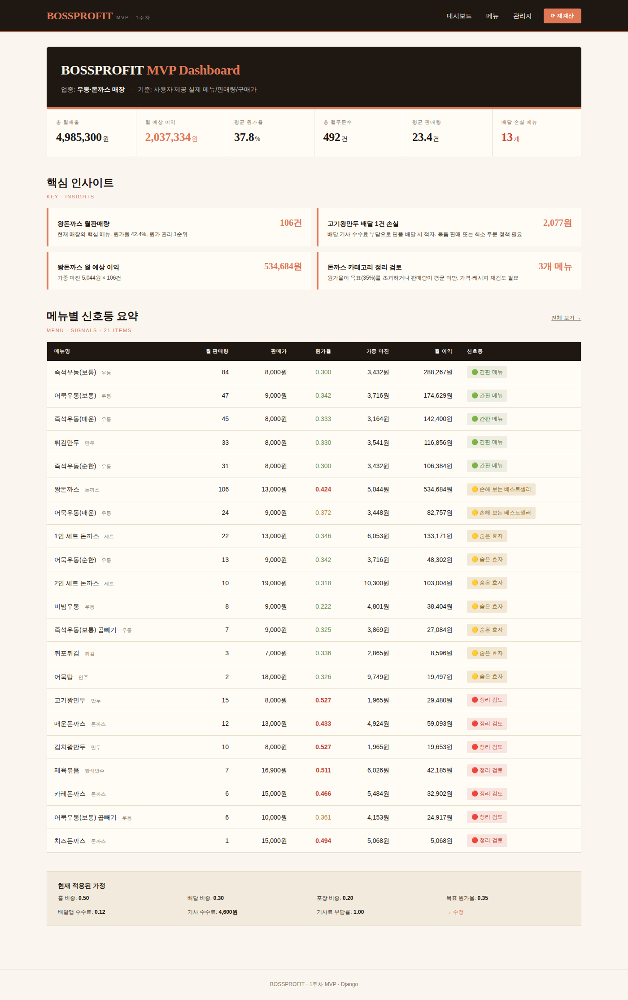
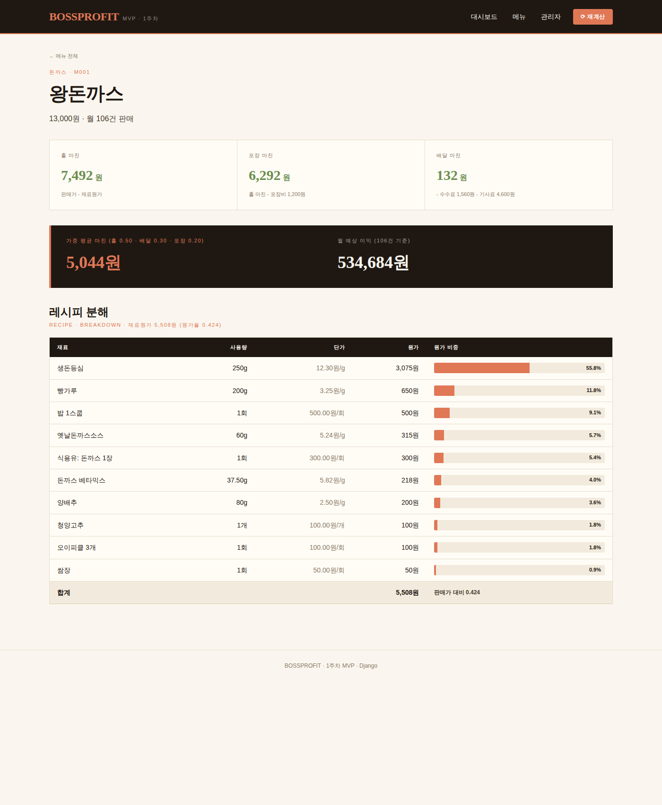

# BOSSPROFIT

소규모 외식 자영업자를 위한 메뉴 단위 원가 및 수익성 분석 프로젝트입니다.

식당 운영 과정에서 메뉴별 재료 원가, 판매가, 배달 수수료, 포장비, 마진을 수기로 계산하기 어렵다는 문제에서 출발했습니다. 초기에는 Django 기반 MVP로 대시보드와 메뉴 상세 화면을 구현했고, 이후 같은 도메인을 TypeScript 기반 REST API로 재구현했습니다.

이 저장소는 하나의 프로젝트를 두 단계로 정리합니다.

```text
08_pjt/
├── bossprofit/              Django 기반 BOSSPROFIT MVP
├── boss-profit-api-ts/      TypeScript 기반 메뉴 원가 관리 API
├── bossprofit_dashboard.png
├── bossprofit_menu_detail.png
└── README.md
```

## 프로젝트 구성

### 1. Django MVP

`bossprofit/` 폴더에 있는 기존 MVP입니다.

엑셀 계산기로 검증한 메뉴 원가 계산 로직을 Django로 옮기고, 대시보드와 메뉴 상세 화면에서 결과를 확인할 수 있도록 구현했습니다.

주요 기능:

- 21개 메뉴, 35개 재료, 118개 레시피 항목 샘플 데이터
- 메뉴별 재료 원가 계산
- 홀, 포장, 배달 마진 계산
- 메뉴별 월 예상 이익 계산
- 신호등 분류
- Django admin을 통한 데이터 수정
- 대시보드 및 메뉴 상세 화면 제공

주요 파일:

```text
bossprofit/
├── manage.py
├── db.sqlite3
├── seed_data.json
├── bossprofit_project/
│   ├── settings.py
│   └── urls.py
└── profit/
    ├── models.py
    ├── calculator.py
    ├── views.py
    ├── urls.py
    ├── admin.py
    ├── templates/
    └── static/
```

### 2. TypeScript API

`boss-profit-api-ts/` 폴더에 있는 서버 API 프로젝트입니다.

기존 Django MVP에서 확인한 메뉴 원가 계산 구조를 바탕으로, TypeScript, Express, Prisma, SQLite를 사용해 관계형 DB 기반 REST API로 재구현했습니다.

주요 기능:

- 메뉴 목록 조회
- 메뉴 상세 조회
- 재료 목록 조회
- 레시피 항목 조회 및 등록
- 메뉴별 원가, 마진, 마진율 계산
- HTML 화면에서 API 결과 확인
- DB 구조 시각화 화면 제공

주요 API:

| Method | URL | 설명 |
|---|---|---|
| GET | `/api/menus` | 메뉴 목록 조회 |
| GET | `/api/menus/:id` | 메뉴 상세 조회 |
| GET | `/api/menus/:id/cost` | 메뉴별 원가 계산 |
| GET | `/api/ingredients` | 재료 목록 조회 |
| GET | `/api/recipe-items` | 레시피 항목 조회 |
| POST | `/api/recipe-items` | 레시피 항목 등록 |

브라우저 화면:

```text
http://localhost:3000
```

DB 구조 화면:

```text
http://localhost:3000/schema.html
```

API 안내:

```text
http://localhost:3000/api
```

## 왜 두 폴더로 나누었는가

이 프로젝트는 먼저 Django로 식당 메뉴 원가 분석 MVP를 만들면서 문제 정의, 샘플 데이터 구성, 계산 로직 검증, 대시보드 화면 구현에 집중했습니다.

이후 같은 도메인의 핵심 구조인 `메뉴`, `재료`, `레시피 항목`, `원가 계산`을 TypeScript 서버 API로 작게 재구현했습니다.

두 폴더의 역할은 다음과 같습니다.

| 폴더 | 역할 |
|---|---|
| `bossprofit/` | Django 기반 원본 MVP. 대시보드와 계산 검증 중심 |
| `boss-profit-api-ts/` | TypeScript 기반 서버 API. RDBMS 설계와 REST API 중심 |

## DB 설계 의도

핵심 모델은 다음 세 가지입니다.

```text
Menu
Ingredient
RecipeItem
```

### Menu

판매 메뉴를 저장합니다.

- 메뉴명
- 카테고리
- 판매가

### Ingredient

재료 정보를 저장합니다.

- 재료명
- 단위
- 단위당 가격

### RecipeItem

메뉴와 재료를 연결하는 중간 테이블입니다.

- 메뉴 ID
- 재료 ID
- 해당 메뉴에 들어가는 재료 사용량

`Menu`와 `Ingredient`는 다대다에 가까운 관계입니다. 하나의 메뉴에는 여러 재료가 들어가고, 하나의 재료는 여러 메뉴에 사용될 수 있습니다.

하지만 단순한 다대다 관계만으로는 "왕돈까스에 돼지고기가 200g 들어간다"처럼 사용량을 저장하기 어렵습니다. 그래서 `RecipeItem`이라는 중간 테이블을 직접 설계해 `quantity`를 저장했습니다.

```text
Menu 1 --- N RecipeItem N --- 1 Ingredient
```

이 구조 덕분에 재료 단가가 바뀌면 해당 재료를 사용하는 메뉴들의 원가 계산 결과가 함께 바뀔 수 있습니다.

## 원가 계산 로직

메뉴 원가는 레시피 항목을 기준으로 계산합니다.

```text
재료별 원가 = 재료 사용량 * 재료 단위당 가격
메뉴 총 원가 = 재료별 원가 합계
마진 = 판매가 - 메뉴 총 원가
마진율 = 마진 / 판매가 * 100
```

예시 응답:

```json
{
  "menu": "왕돈까스",
  "price": 13000,
  "total_cost": 1860,
  "margin": 11140,
  "margin_rate": 85.69,
  "items": [
    {
      "ingredient": "돼지고기",
      "quantity": 200,
      "unit": "g",
      "unit_price": 7,
      "cost": 1400
    }
  ]
}
```

## 실행 방법

### Django MVP 실행

```bash
cd bossprofit
python -m venv venv
source venv/Scripts/activate
pip install -r requirements.txt
python manage.py migrate
python manage.py seed_data
python manage.py runserver
```

접속:

```text
http://127.0.0.1:8000
```

### TypeScript API 실행

```bash
cd boss-profit-api-ts
npm install
copy .env.example .env
npx prisma generate
npx prisma migrate dev --name init
npm run seed
npm run dev
```

접속:

```text
http://localhost:3000
http://localhost:3000/schema.html
http://localhost:3000/api/menus
http://localhost:3000/api/menus/1/cost
```

Windows 로컬 환경에서 Prisma 마이그레이션이 실패하면 아래 순서로 SQLite 테이블을 직접 생성할 수 있습니다.

```bash
npm run db:create
npx prisma generate
npm run seed
npm run dev
```

## 현재 구현 수준

완료한 부분:

- 식당 메뉴 원가 관리 도메인 정의
- Django 기반 MVP 화면 구현
- 메뉴, 재료, 레시피 항목 모델 구성
- 메뉴별 원가 및 마진 계산 로직 구현
- TypeScript 기반 REST API 재구현
- Prisma ORM과 SQLite 기반 관계형 DB 모델 작성
- API 결과 확인용 HTML 화면 추가
- DB 구조 시각화 화면 추가
- 샘플 데이터 입력 및 API 응답 검증

아직 부족한 부분:

- 사용자 로그인
- 매장별 데이터 분리
- 사용자가 직접 메뉴와 재료를 입력하는 완성형 UI
- 재료 단가 변경 이력 관리
- 외부 식재료 시세 API 연동
- 배포
- 테스트 코드

## 구현 포인트

- 메뉴와 재료를 별도 테이블로 분리했습니다.
- 메뉴와 재료 사이에 `RecipeItem` 중간 테이블을 두어 재료 사용량을 저장했습니다.
- DB에 저장된 관계 데이터를 기반으로 메뉴별 원가와 마진을 계산했습니다.
- 계산 로직을 API로 제공해 브라우저나 다른 클라이언트에서 사용할 수 있도록 했습니다.
- Django MVP와 TypeScript API를 분리해 화면 검증과 서버 API 구현을 각각 확인할 수 있도록 했습니다.

## 스크린샷

### Django 대시보드



### Django 메뉴 상세


