# BOSSPROFIT — 식재료 시장가격 예측 기반 외식 자영업 의사결정 서비스

> "어떤 재료의 가격이 오르고, 내 매장의 어떤 메뉴를 먼저 확인해야 하는지"를
> 데이터 근거와 함께 알려주고, 대응 행동까지 정리해 주는 사장님용 의사결정 도구.

식재료 시장가격을 예측하고, 그 가격 변화가 내 매장의 어떤 메뉴 수익성에 영향을
주는지 계산한 뒤, 검증 가능한 근거에 기반한 대응 행동(action plan)까지 정리합니다.
매장 POS 판매 데이터, KAMIS 소매·도매가격, 도매시장 경락 거래량, 주산지 기상
데이터를 하나의 파이프라인에서 다루며, **데이터가 부족할 때는 수익성·정확도를
임의로 단정하지 않는 것**을 핵심 원칙으로 삼았습니다.

---

## 목차

- [A. 팀원 정보 및 업무 분담](#a-팀원-정보-및-업무-분담)
- [B. 목표 서비스 및 실제 구현 정도](#b-목표-서비스-및-실제-구현-정도)
- [C. 데이터베이스 모델링 (ERD)](#c-데이터베이스-모델링-erd)
- [D. 추천 알고리즘에 대한 기술적 설명](#d-추천-알고리즘에-대한-기술적-설명)
- [E. 핵심 기능 설명](#e-핵심-기능-설명)
- [F. 생성형 AI를 활용한 부분](#f-생성형-ai를-활용한-부분)
- [G. 서비스 URL / 배포](#g-서비스-url--배포)
- [H. 기타 — 실행 방법·소스 구조·기획 문서](#h-기타--실행-방법소스-구조기획-문서)
- [실행 화면 캡쳐](#실행-화면-캡쳐)
- [단계별 구현 과정에서 배운 점·어려웠던 점·느낀 점]
---

## A. 팀원 정보 및 업무 분담

> 본 프로젝트는 **프론트엔드·UI/UX / 백엔드·API / DB·데이터 엔지니어링 / ML·RAG·LLM**

| 이름 | 담당 영역 | 주요 업무 |
| --- | --- | --- |
| **조윤 (theoyun)** | 백엔드·API / DB·데이터·예측 엔진 | Django REST API, JWT 인증·매장 스코프, 온보딩 상태 머신, 재료·메뉴·레시피 트랜잭션 API, 판매량 idempotent 입력, 원가·마진 계산 서비스, 단계형 시장 예측 엔진(Base→Weather→Residual)·게이트웨이, ERD·마이그레이션, KAMIS·도매경락·기상 수집 파이프라인(증분 upsert·lineage), 예측 백테스트, 행동계획 저장, LLM 연동, 권한·계약 테스트 |
| **김성민** | 프론트엔드·UI/UX | Vue 3 SPA·디자인 토큰/반응형 셸, 단계형 회원가입·온보딩, 재료·메뉴/레시피 등록 마법사, 오늘(대시보드) 화면·매출 캘린더 장부, 시장 품목 상세·예측구간 그래프·전망 막대, 119 채팅·행동계획 확인/회고, Playwright E2E, PPT 자료 준비 및 발표 |

> 상세 백로그는 [`BOSSPROFIT_DEVELOPMENT_PLAN.md`](BOSSPROFIT_DEVELOPMENT_PLAN.md) 의 팀별 개발 백로그 참고.

---

## B. 목표 서비스 및 실제 구현 정도

### 목표 서비스

외식 자영업 사장님이 "재룟값이 오른다는데 내 가게는 괜찮은가?"라는 막연한 불안을,
**(1) 시장가격 예측 → (2) 내 메뉴 영향 계산 → (3) 근거 기반 행동 전략**의 3단계
의사결정 흐름으로 바꿔 주는 것이 목표입니다.

### 핵심 흐름

```text
1. 시장가격 예측        KAMIS·도매·기상 데이터로 품목별 가격·예측구간 산출
        ↓
2. 내 메뉴 영향 계산    레시피·원가 연결을 통해 어떤 메뉴가 얼마나 흔들리는지
        ↓
3. 근거 기반 행동 전략  미리구매/관망/보류 권고 + 행동계획(목표·중단조건) 저장
```

### 실제 구현 정도

| 영역 | 기능 | 구현 상태 |
| --- | --- | --- |
| 인증·온보딩 | JWT 로그인/회원가입, 매장·멤버십, 단계형 온보딩 상태머신 | ✅ 구현 |
| 매장 데이터 | 재료·메뉴·레시피 CRUD, 손익 가정(채널 비중·수수료), **본사 납품 재료 플래그** | ✅ 구현 |
| POS 연동 | 수원세류점 엑셀 파서(병합셀·중복 합산·idempotent import) | ✅ 구현 |
| 수익성 계산 | 홀/포장/배달 채널별 마진, 가중 마진, 신호등 분류, 스냅샷 | ✅ 구현 |
| 수익성 표시 | **재료원가·원가율·재료마진을 시장 연결과 분리해 레시피만 있으면 계산** | ✅ 구현 |
| 매출 분석 | 일자별 매출 캘린더 장부 + **일자별 메뉴 매출표**, 기간 선택, 상위 메뉴·추이 | ✅ 구현 |
| 홈 매출 카드 | **오늘 실제 매출 + AI 예측 매출(최근 일평균)** 요약 카드 | ✅ 구현 |
| 홈 매출 장부 | **매출 캘린더 장부를 오늘(홈) 화면 최하단에 배치**(리포트에서 이동) | ✅ 구현 |
| 시장 예측 | 단계형 예측엔진(Base→Weather→Residual), 예측구간·신뢰등급 | ✅ 구현 |
| 시장 예측 그래프 | **과거 실적 + 7일 일별 예측 시계열(신뢰구간 음영) 그래프** | ✅ 구현 |
| 시장 전망 막대 | **1·7·30일 전망을 부호 반영 다이버징 막대(상승↑/하락↓)로 표시** | ✅ 구현 |
| 시장 랭킹·추천 | 오늘/내일 변동 TOP5, 미리구매/관망/보류 권고 + 근거 | ✅ 구현 |
| 시장→내 가게 연동 | **품목 상세에서 "내 가게 영향 계산"·"119 대응 전략" 버튼 동작** | ✅ 구현 |
| 데이터 수집 | KAMIS·도매경락·ASOS·예보 ingest 커맨드 + lineage(raw payload) | ✅ 구현 |
| 예측 평가 | rolling-origin backtest, WAPE/MASE/MAE/RMSE/pinball/coverage | ✅ 구현 |
| 생성형 AI | 매장 데이터 근거 "사장님 119" Q&A, 리포트 핵심 요약 | ✅ 구현 |
| RAG / pgvector | 시장 주간 요약 문서화·hybrid retrieval | 🔶 설계·일부(향후) |
| 배포 | 로컬 실행(Django + Vite). 클라우드 배포 | ⬜ 미배포 |

> **설계 원칙상 "검증되지 않은 정확도·매출 개선 수치는 화면에 노출하지 않는다."**
> 모델 성능 지표는 `is_verified` 플래그가 설정된 경우에만 사용자에게 보여줍니다.

---

## C. 데이터베이스 모델링 (ERD)

Django ORM 기반. 핵심은 **(1) 매장 소유 데이터**, **(2) 시장·외부 데이터(원본 보존)**,
**(3) 예측·평가 산출물** 세 그룹으로 나뉩니다. 모든 외부 데이터는 `RawSourcePayload`로
원본 응답과 `IngestionRun` lineage를 보존해 동일 조건 재현이 가능합니다.

```mermaid
erDiagram
    User ||--o{ StoreMember : "가입"
    Store ||--o{ StoreMember : "구성원"
    Store ||--|| OnboardingProgress : "온보딩"
    Store ||--o{ Ingredient : "보유"
    Store ||--o{ Menu : "판매"
    Store ||--o{ DailyMenuSale : "일판매"
    Store ||--o{ ProfitAssumption : "손익가정"
    Store ||--o{ MenuProfitSnapshot : "수익스냅샷"
    Store ||--o{ ActionPlan : "행동계획"
    Store ||--o{ StoreSalesImport : "POS적재"

    Menu ||--o{ RecipeItem : "레시피"
    Ingredient ||--o{ RecipeItem : "사용"
    Ingredient ||--o{ PurchasePriceObservation : "구매이력"
    Menu ||--o{ DailyMenuSale : "판매기록"
    Menu ||--o{ MenuProfitSnapshot : "계산결과"
    StoreSalesImport ||--o{ DailyMenuSale : "출처"

    Ingredient ||--o{ IngredientMarketMapping : "시장연결"
    MarketItem ||--o{ IngredientMarketMapping : "매핑"

    MarketItem ||--o{ MarketPriceObservation : "관측"
    MarketItem ||--o{ MarketForecast : "예측"
    MarketItem ||--o{ MarketRecommendation : "권고"
    MarketItem ||--o{ MarketRankingSnapshot : "랭킹"
    MarketItem ||--o{ WeatherExposureFeature : "기상노출"
    MarketItem ||--o{ WholesaleAuctionObservation : "경락"

    ForecastRun ||--o{ ForecastPoint : "예측점"
    ForecastPoint ||--|| ForecastComponent : "구성요소"
    ForecastRun ||--o{ MarketForecast : "발행"
    MarketItem ||--o{ OutOfFoldForecast : "OOF"
    OutOfFoldForecast ||--|| ResidualObservation : "잔차"

    IngestionRun ||--o{ RawSourcePayload : "원본"
    RawSourcePayload ||--o{ MarketPriceObservation : "lineage"
    RawSourcePayload ||--o{ WeatherObservation : "lineage"
```

**모델 그룹별 요약** (전체 33개 모델)

**① 매장 소유 데이터 (멀티테넌트)**

- `Store / StoreMember / OnboardingProgress` — 매장 단위 멀티테넌시와 권한(OWNER/MANAGER/STAFF), 온보딩 진행 상태머신
- `Ingredient` — 구매단위·구매가격을 그대로 저장하고 `unit_cost`(단위원가)는 property로 자동 계산. *"1kg에 12,300원에 샀어요"를 그대로 입력*하는 게 직관적이라는 설계 의도. 본사 납품(납품가 고정) 플래그 보유
- `Menu / RecipeItem` — 메뉴 × 재료 사용량. `food_cost()`/`food_cost_rate()`는 레시피에서 동적 계산
- `PurchasePriceObservation` — 재료 구매가격 이력
- `ProfitAssumption` — 매장 단위 손익 가정(홀/배달/포장 비중, 배달 수수료·기사료, 목표 원가율)
- `MenuProfitSnapshot` — 채널별 마진·가중 마진·신호등 계산 결과를 시계열로 보존
- `DailyMenuSale / StoreSalesImport` — POS 일판매. `(store, menu, date, channel)` 유니크 + 파일 sha256으로 idempotent
- `ActionPlan` — 추천을 받아 목표·기간·성공/중단 조건·회고일까지 구조화한 행동계획

**② 시장·외부 데이터 (원본 보존)**

- `MarketItem / MarketPriceObservation` — 시장 품목과 출처·수집시각이 보존되는 관측값
- `WholesaleAuctionObservation` — 도매시장 경락가격·거래량(공급 변수)
- `CropProductionRegion / WeatherStationMapping` — 주산지·기상 관측소 매핑(버전·신뢰도 보존)
- `WeatherObservation / WeatherForecastSnapshot / WeatherExposureFeature` — 기상 실측·예보(issued/valid 시각 분리)·품목별 기상 노출 피처
- `ProductionStatistic` — 재배면적·생산량 등 수급 통계
- `IngredientMarketMapping` — 내 재료 ↔ 시장 품목 매핑(상태·신뢰도)
- `IngestionRun / RawSourcePayload` — 외부 데이터 수집 lineage와 불변 원본 보존

**③ 예측·평가 산출물**

- `ForecastRun / ForecastPoint / ForecastComponent` — 예측 실행·예측점·단계별 보정량(base/weather/residual) 분리 저장. `lower ≤ median ≤ upper` DB CheckConstraint로 강제
- `OutOfFoldForecast / ResidualObservation / ForecastCalibration` — rolling-origin OOF 예측과 잔차, 구간 보정 파라미터
- `MarketForecast` — 발행된 horizon별(1·7·30일) 예측값·예측구간·신뢰등급
- `MarketModelMetric / ForecastModelComparison` — 검증 지표와 baseline 대비 paired-bootstrap 비교
- `MarketRecommendation / MarketRankingSnapshot` — 추천 결정·근거와 순위 변동 스냅샷

전체 모델 정의: [`bossprofit/profit/models.py`](bossprofit/profit/models.py),
[`bossprofit/accounts/models.py`](bossprofit/accounts/models.py)

---

## D. 추천 알고리즘에 대한 기술적 설명

추천은 두 단계로 구성됩니다. **(1) 가격을 예측하는 통계 모델**과,
**(2) 예측을 사장님이 바로 행동할 수 있는 구매 결정으로 번역하는 규칙 엔진**입니다.

### D-1. 단계형 가격 예측 엔진

예측값을 단일 블랙박스로 두지 않고, **각 보정 성분을 분리해 저장**합니다.
이렇게 하면 "왜 이 예측이 나왔는가"를 화면에서 그대로 설명할 수 있습니다.

```text
final_prediction = base_prediction + weather_adjustment + residual_adjustment
```

| 단계 | 모델 | 설명 |
| --- | --- | --- |
| ① Base | `BasePriceModel` | 최근 90일 로그가격에 **damped log-trend** 회귀. 일 변동률을 ±3%로 clamp, horizon이 길수록 추세를 감쇠(`1 - e^(-h/30)`). 요일 계절 anchor와 0.75:0.25로 가중 결합 |
| ② Weather | `WeatherSupplyImpactModel` | 주산지 기상 노출(`WeatherExposureFeature`)에서 학습된 보정률이 있을 때만 적용. **없으면 0** (임의 추정 금지) |
| ③ Residual | `ResidualCorrectionModel` | rolling-origin **OOF 잔차**의 평균을 표본 수 기반 shrinkage(`n/(n+20)`)로 축소 적용. 잔차 8건 미만이면 0 |
| ④ Interval | `IntervalCalibration` | OOF로 보정된 절대오차 분위수로 예측구간 산출. 보정 데이터가 없으면 horizon √ 스케일의 보수적 기본폭 사용 |

**검증 없는 모델은 자동 강등.** `ForecastModelComparison`에 paired-bootstrap으로
"후보 모델이 last-value baseline보다 유의하게 나쁘다"는 결과가 있으면, 엔진은 해당
horizon에서 base를 **마지막 값(naive)으로 fallback**합니다. 즉 *우리 모델이 단순
기준선보다 못하다는 통계적 증거가 있으면 그 모델을 쓰지 않습니다.*

> 구현: [`bossprofit/profit/forecasting/engine.py`](bossprofit/profit/forecasting/engine.py),
> 평가: [`bossprofit/profit/forecasting/evaluation.py`](bossprofit/profit/forecasting/evaluation.py)

### D-2. 구매 추천 규칙 엔진

예측 변동률(`expected_change_rate`)을 임계값 기준으로 행동 언어로 변환합니다.

| 1일 예상 변동률 | 결정 | 권고 메시지 |
| --- | --- | --- |
| `≥ +3%` | **BUY (미리 구매 검토)** | 필요한 물량을 분할 선매입 검토 |
| `−3% ~ +3%` | **WATCH (관망)** | 신호가 약함, 다음 관측 확인 |
| `≤ −3%` | **AVOID (구매 보류)** | 대량 선매입보다 필요한 만큼만 |

각 추천에는 **근거(evidence)** 가 항상 붙습니다 — KAMIS 최근 실제가격, 1일 예측구간,
모델 신뢰등급. 시장 랭킹은 `|변동률|`을 점수로 정렬한 **오늘/내일 TOP5**로 제공하고,
직전 순위 대비 이동(`previous_rank`)을 함께 보존합니다.

> 구현: [`rebuild_market_rankings.py`](bossprofit/profit/management/commands/rebuild_market_rankings.py)
> 의 `decision_for()` 및 `MarketRecommendation` 생성부

### D-3. 메뉴 수익성 신호등(분류) 알고리즘

매장 메뉴는 **판매량 × 원가율** 2축으로 분류해 "어떤 메뉴부터 손봐야 하는지"를
신호등으로 보여줍니다. 배달 마진과 가중 마진이 모두 음수면 무조건 🔴.

```text
판매량 ↑ & 원가율 ↓ → 🟢 간판 메뉴
판매량 ↑ & 원가율 ↑ → 🟡 손해 보는 베스트셀러
판매량 ↓ & 원가율 ↓ → 🟡 숨은 효자
판매량 ↓ & 원가율 ↑ → 🔴 정리 검토
배달·가중 마진 < 0  → 🔴 배달 손실
```

> 구현: [`bossprofit/profit/calculator.py`](bossprofit/profit/calculator.py) 의 `classify()`

---

## E. 핵심 기능 설명

1. **오늘(대시보드)** — 가장 위험한 재료와 예측구간을 먼저 보여주고, 매출 카드·핵심
   추천 메뉴·판매 상위 메뉴·재료 가격 위험을 한 화면에 요약. 화면 **최하단에는 매출
   캘린더 장부**를 두어 "지금 무엇을 봐야 하는지"부터 "이번 달 매출 흐름"까지 한 번에 본다.
2. **메뉴·레시피 관리** — 재료 구매단위/가격 입력 → 레시피 연결 → 채널별 마진·신호등
   자동 계산. 수익성(원가율·재료마진)은 **시장 연결 여부와 분리**해 레시피·원가만 있으면
   바로 계산·표시한다. 레시피·원가가 연결되지 않은 메뉴는 `분석 대기`로 분리해 *추정으로
   채우지 않음*. 판매량 상위 메뉴는 원가 준비 여부와 무관하게 `판매 주력`으로 유지.
3. **본사 납품 재료 구분** — 재료마다 "본사 납품(납품가 고정)" 여부를 체크할 수 있고,
   본사 납품 재료는 **시장가격 위험·시장 품목 연결 대상에서 제외**한다. 우동면처럼
   가격 변동이 거의 없는 재료에 불필요한 "시장 연결 필요" 경고가 뜨지 않게 하는 장치.
4. **매출 캘린더 장부** — POS 일판매를 캘린더로 보고, 날짜를 누르면 그날의 메뉴별
   판매량·실매출 매출표(모달). 누락 날짜를 0으로 만들지 않음. (홈 화면 최하단에 배치)
5. **홈 오늘 매출 카드** — 가장 최근 판매일의 **실제 매출**과 최근 일평균 기반
   **AI 예측 매출**을 한 카드에 표시(추정값은 'AI 예측'으로 명시).
6. **시장 인텔리전스** — 품목별 **과거 실적 + 7일 일별 예측 시계열 그래프**(예측구간을
   음영으로 표시), **1·7·30일 전망을 부호 반영 다이버징 막대**(상승은 위·하락은 아래)로
   표시, 오늘/내일 변동 TOP5 랭킹, 미리구매/관망/보류 추천.
7. **시장 → 내 가게 연동** — 품목 상세에서
   - **"내 가게 영향 계산"**: 매장 분석(`/analysis/store/`)의 시장 위험을 현재 품목 코드로
     매칭해, 영향받는 내 메뉴·예상 변동률·현재가를 모달로 표시(연결 메뉴가 없으면 재료
     연결을 유도).
   - **"119에 대응 전략 묻기"**: 해당 품목 맞춤 질문을 자동 생성해 AI 어드바이저
     (`/analysis/follow-up/`)에 보내고 대응 전략을 모달로 표시.
8. **내 가게 영향 분석 리포트** — 시장 위험을 내 메뉴에 연결해 영향 메뉴를 도출하고,
   판매 상위 메뉴·추이와 함께 분석 한계를 명시. 분석 기간(프리셋/날짜) 선택 가능.
9. **행동계획(Action Plan)** — 추천을 받아 제목·기간·이유·기대효과·**성공/중단 조건·
   회고일**까지 구조화해 저장(가설을 검증 가능한 형태로).
10. **데이터 수집 파이프라인** — KAMIS 일별/기간, 도매 경락, 기상 ASOS·예보를 멱등
    upsert로 수집하고 원본·lineage 보존.

주요 API: [`bossprofit/profit/api_urls.py`](bossprofit/profit/api_urls.py)

```text
GET  /api/v1/public/product-preview/      비로그인 품목 미리보기
GET  /api/v1/dashboard/                   오늘 대시보드
GET  /api/v1/analysis/store/?from=&to=    매장 분석 (기간 선택, 시장 위험 포함)
GET  /api/v1/analysis/report/             영향 분석 리포트
GET  /api/v1/analysis/calendar/?year=&month=  월별 매출 캘린더
GET  /api/v1/analysis/calendar/day/?date= 일자별 메뉴 매출표
POST /api/v1/analysis/follow-up/          사장님 119 (LLM Q&A)
POST /api/v1/action-plans/                행동계획 저장
GET  /api/v1/market/rankings/<type>/      오늘·내일 변동 랭킹·품목 상세
```

> 매장 소유 데이터는 인증된 사용자의 `store` 범위에서만 조회됩니다(교차 접근 차단).

---

## F. 생성형 AI를 활용한 부분

생성형 AI는 **매장의 실제 데이터를 컨텍스트로 주입한 뒤에만** 답하도록 제한했습니다.
OpenAI SDK를 쓰되 `OPENAI_BASE_URL`·`OPENAI_MODEL` 환경변수로 **OpenAI 호환 프록시**를
연결할 수 있게 해, 실제 제출 환경에서는 **SSAFY GMS 게이트웨이**
(`https://gms.ssafy.io/gmsapi/api.openai.com/v1`)를 통해 동작합니다. 직접 OpenAI 키 없이
GMS 키만으로 작동하며, 키가 없으면 규칙 기반 분석으로 자동 폴백합니다.

1. **사장님 119 (근거 기반 Q&A)** — 매장 POS 판매 요약·상위 메뉴·재료 가격 위험을
   구조화한 컨텍스트(`build_store_context`)를 system 프롬프트에 넣고 질문에 답변.
   *"데이터에 없는 내용은 솔직히 모른다고 말할 것"* 을 규칙으로 강제해 환각을 억제.
   시장 품목 상세의 **"119에 대응 전략 묻기"** 버튼이 이 엔드포인트를 호출한다.
2. **리포트 핵심 요약** — 분석 결과를 2문장 인사이트로 요약(`generate_report_summary`).
   API 키가 없거나 호출 실패 시 LLM 없이도 동작하도록 graceful fallback(`used_llm=False`).

> 구현: [`bossprofit/profit/llm_service.py`](bossprofit/profit/llm_service.py)

또한 본 프로젝트의 **기획·설계 문서와 구현 보조에 Claude / 코딩 어시스턴트**를
활용했습니다(설계 검토, 데이터 모델 정합성 점검, 테스트 시나리오 작성, UI 리팩터링 등).

---

## G. 서비스 URL / 배포

- **현재 상태: 미배포 (로컬 실행 환경 제공).**
- 프론트엔드: <http://127.0.0.1:5173/>
- API: <http://127.0.0.1:8000/api/v1/>
- 배포 시 `DJANGO_ALLOWED_HOSTS` / `CORS_ALLOWED_ORIGINS` 환경변수로 도메인 등록.

---

## H. 기타 — 실행 방법·소스 구조·기획 문서

### 기술 스택

| 구분 | 기술 |
| --- | --- |
| 프론트엔드 | Vue 3, Vite, Pinia, Vue Router, Chart.js(vue-chartjs), Bootstrap, Axios |
| 백엔드 | Django 5, Django REST Framework, SimpleJWT, django-cors-headers, SQLite(개발) |
| 데이터/AI | openpyxl(POS 파싱), Pillow, OpenAI SDK, 자체 통계 예측 엔진, LightGBM(글로벌 분위 모델)·scikit-learn |
| 테스트 | Django test, Playwright(E2E) |

### 소스 구조

```text
frontend/                    Vue 3 + Vite + Pinia SPA
  src/views/                 화면(대시보드·메뉴·시장·리포트·온보딩 등)
  src/api/                   axios client·endpoints
bossprofit/
  accounts/                  인증·매장·멤버십·온보딩 모델
  profit/
    models.py                전체 데이터 모델(33개)
    calculator.py            수익성 계산·신호등 분류
    analysis_service.py      매출/영향 분석·시장 위험
    llm_service.py           생성형 AI 연동
    api_views.py / api_urls.py   REST API
    forecasting/             단계형 예측 엔진(engine.py)·평가(evaluation.py)·LightGBM 글로벌 모델(lightgbm_model.py)
    integrations/            KAMIS(kamis.py)·data.go.kr(data_go_kr.py) 클라이언트
    management/commands/      데이터 수집·예측·랭킹·시드·LightGBM 학습/백테스트 커맨드
    fixtures/                bootstrap.json (loaddata용 데모 DB 스냅샷)
artifacts/ui/                실행 화면 캡쳐(데스크톱·모바일)
```

### 로컬 실행

```bash
# 백엔드
cd bossprofit
python manage.py migrate
python manage.py loaddata bootstrap   # 데모 DB 스냅샷 전체 복원(권장, 아래 참고)
python manage.py runserver 127.0.0.1:8000

# 프론트엔드 (별도 터미널)
cd frontend
npm install
npm run dev -- --host 127.0.0.1
```

> 💡 **데모 데이터 적재 방법 2가지**
> - **`loaddata bootstrap`** (권장): 매장·메뉴·매출·시장·예측·랭킹까지 **DB 전체
>   스냅샷**([`profit/fixtures/bootstrap.json`](bossprofit/profit/fixtures/bootstrap.json))을
>   한 번에 복원합니다. **빈 DB(또는 flush 직후)** 에 적재하세요.
> - **`seed_data`**: 메뉴·재료·레시피 위주의 커스텀 시드만 적재합니다(시장·예측 제외).
>
> fixture 재생성(Windows에서는 `-o` 대신 UTF-8 stdout 리다이렉트 필수):
> ```bash
> PYTHONIOENCODING=utf-8 python manage.py dumpdata auth.user accounts profit \
>   --natural-foreign --indent 2 > profit/fixtures/bootstrap.json
> ```

> ⚠️ **Windows 주의:** `node_modules`가 다른 OS(macOS 등)에서 설치된 채로 복사되면
> Vite(rolldown)의 네이티브 바이너리·`.cmd` 셰임이 없어 `vite`가 실행되지 않습니다.
> 이 경우 `node_modules`를 지우고 Windows에서 `npm install`을 다시 실행하세요.

POS 엑셀 적재:

```bash
cd bossprofit
python manage.py import_store_sales_xlsx "<엑셀1>" "<엑셀2>" \
  --username <사용자명> --store-name "<매장명>" --region "<지역>"
# 같은 파일 재적재 시 sha256으로 중복을 막고, --replace-sales 로 해당 기간 갱신
```

데모 계정 구성:

```bash
python manage.py seed_demo_account --username <사용자명> --password <비밀번호>
python manage.py seed_market_demo   # 시장 품목·예측·랭킹 데모
```

실데이터 수집(키 필요, 멱등 upsert):

```bash
python manage.py ingest_kamis_daily        # KAMIS 일별 소매가
python manage.py ingest_kamis_period       # KAMIS 기간 가격
python manage.py ingest_wholesale_auctions # 도매시장 경락가격·거래량
python manage.py ingest_kma_asos           # 기상청 ASOS 실측
python manage.py ingest_kma_short_forecast # 단기예보
python manage.py ingest_kma_mid_forecast   # 중기예보
python manage.py build_weather_exposures   # 품목별 기상 노출 피처
python manage.py train_lightgbm_forecast   # 글로벌 LightGBM 분위 모델 학습(장기 horizon)
python manage.py run_market_forecast       # 단계형 예측 실행(장기는 LightGBM 사용)
python manage.py backtest_market_forecast  # rolling-origin 백테스트(통계 모델)
python manage.py backtest_lightgbm         # LightGBM vs 통계·naive 베이스라인 비교
python manage.py rebuild_market_rankings   # 랭킹·추천 재생성
```

> 🤖 **예측 모델:** 단기(1·7일)는 통계 모델/last-value, 장기(14일 이상)는 학습된
> **글로벌 LightGBM 분위 모델**(`train_lightgbm_forecast`로 생성한 아티팩트)을 사용합니다.
> 아티팩트가 없으면 통계 모델로 자동 폴백합니다. 백테스트상 LightGBM은 장기 horizon과
> 관측이 얇은 품목에서 베이스라인을 앞섭니다.

> 수집 명령·환경변수 상세는 [`bossprofit/DATA_PIPELINE.md`](bossprofit/DATA_PIPELINE.md) 참고.

### 검증

```bash
cd bossprofit && python manage.py test
python manage.py makemigrations --check --dry-run
cd ../frontend && npm run build && npx playwright test
```

### 이전까지 작성한 기획 및 설계 문서 (전체)

| 문서 | 내용 |
| --- | --- |
| [BOSSPROFIT_MASTER_REPORT.md](BOSSPROFIT_MASTER_REPORT.md) | 통합 제품·기술 기획 보고서 (문제의식·제품정의·사용자여정·팀별 설계) |
| [BOSSPROFIT_DEVELOPMENT_PLAN.md](BOSSPROFIT_DEVELOPMENT_PLAN.md) | 개발 실행 기획서 (정보구조·데이터모델·팀 백로그·예측/RAG/LLM 기준·일정·DoD) |
| [bossprofit/DATA_PIPELINE.md](bossprofit/DATA_PIPELINE.md) | 실데이터 수집 명령·환경변수 가이드 |
| [bossprofit/SETUP.md](bossprofit/SETUP.md) | 백엔드/프론트 셋업 가이드 |
| [AGENTS.md](AGENTS.md) | 코딩·협업 규칙 |

---

## 실행 화면 캡쳐

| 화면 | 데스크톱 | 모바일 |
| --- | --- | --- |
| 랜딩 | 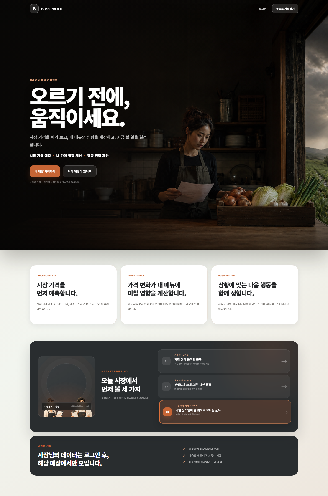 | 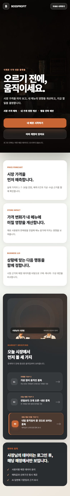 |
| 대시보드(오늘) | 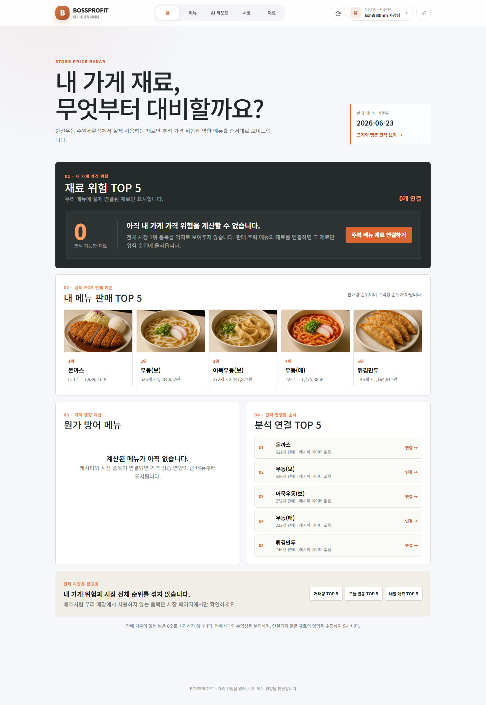 | 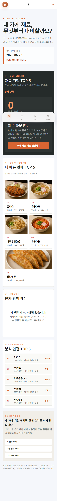 |
| 메뉴·수익성 | 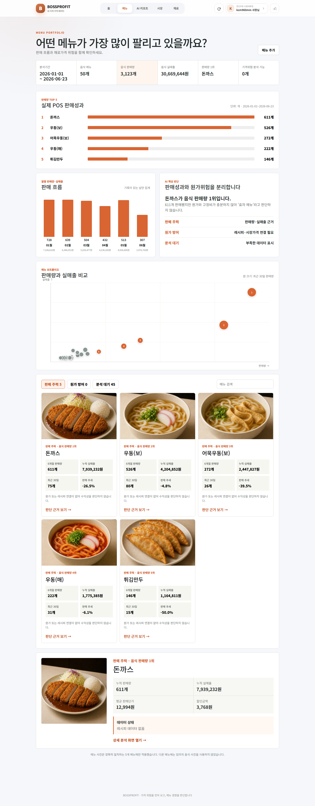 | 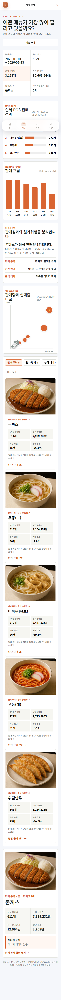 |
| 분석 리포트 | 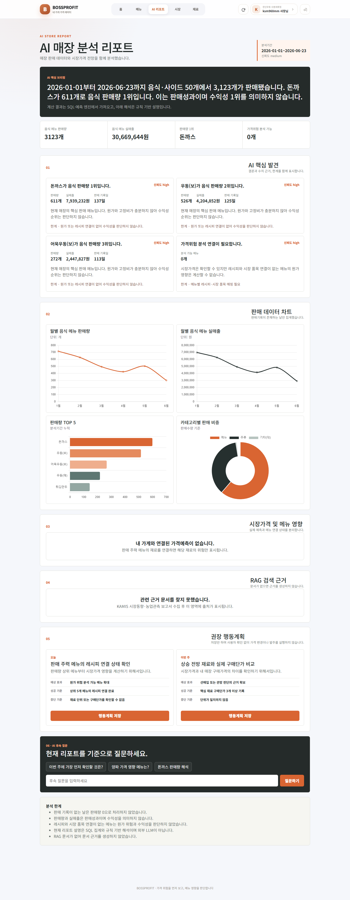 | 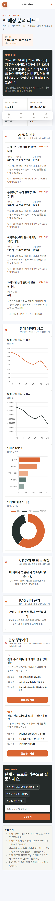 |
| 시장 품목 상세 | 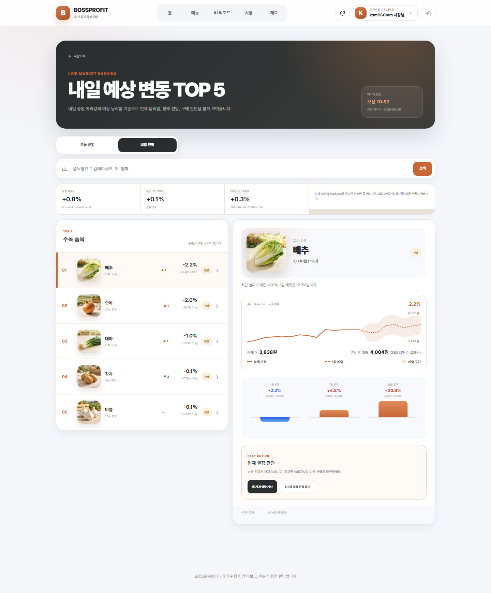 | 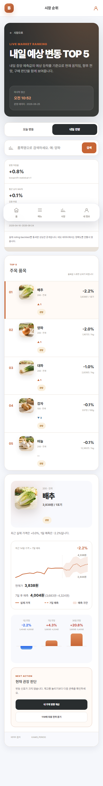 |

> 캡쳐 원본: [`artifacts/ui/`](artifacts/ui/). 시장 품목 상세 캡쳐에는 예측구간 그래프,
> **부호 반영 1·7·30일 전망 막대**, "내 가게 영향 계산"·"119 대응 전략" 버튼이 포함됩니다.
> 캡쳐는 데브 서버 실행 상태에서 `npx playwright test market-capture.spec.js`로 재생성할 수 있습니다.

---

## 단계별 구현 과정에서 배운 점·어려웠던 점·느낀 점

### 1단계 — 데이터 모델 설계: "입력은 사장님 언어로, 계산은 시스템이"

처음엔 재료에 `unit_cost`(1g당 원가)를 직접 저장하려 했지만, 사장님은 "1kg에
12,300원"으로 생각하지 "1g당 12.3원"으로 생각하지 않는다는 점이 걸렸습니다. 그래서
**구매 수량·구매 가격을 그대로 저장하고 단위원가는 property로 파생**시키는 구조로
바꿨습니다.
→ *배운 점:* 데이터 모델은 "계산 편의"가 아니라 "입력하는 사람의 멘탈 모델"을 따라야
한다. 파생 가능한 값은 저장하지 않는 것이 정합성에도 유리하다.

### 2단계 — 수익성 계산: 채널마다 비용 구조가 다르다

홀·포장·배달의 마진이 완전히 다르다는 게 핵심 난관이었습니다. 배달은 앱 수수료(%) +
기사료(정액 × 부담률)가 추가로 빠지기 때문에, "잘 팔리는데 배달에선 손해 보는 메뉴"가
실제로 존재했습니다. 이를 가중 마진과 신호등으로 시각화했습니다.
→ *어려웠던 점:* 손익 가정(채널 비중·수수료율)을 매장마다 다르게 두면서도 기본값으로
graceful하게 동작시키는 `ProfitAssumption.get_active()` 분기 처리.
→ *느낀 점:* "이익이 난다/안 난다"는 단일 숫자가 아니라 **채널 구성에 대한 가정의 함수**다.

### 3단계 — 시장 예측 엔진: 블랙박스를 거부하기

가장 많이 배운 단계입니다. 단일 모델로 가격을 예측하면 화면에서 설명할 수가 없었습니다.
그래서 `base + weather + residual`로 **성분을 분리 저장**하고, 각 단계가 *데이터가
부족하면 0을 반환*하도록 했습니다.
→ *어려웠던 점:* "예측을 멋지게 만들고 싶은 욕심"과 "검증되지 않은 수치를 보여주면
안 된다"는 원칙의 충돌. 결국 **paired-bootstrap으로 baseline보다 유의하게 나쁜
모델은 자동으로 naive fallback** 시키는 안전장치를 넣었습니다.
→ *배운 점:* 예측에서 정말 어려운 건 모델 정확도가 아니라 **point-in-time 데이터 누수
방지**(미래 정보를 학습에 쓰지 않기)와 **rolling-origin OOF 잔차** 관리였다.
→ *새로 배운 것:* WAPE/MASE/pinball loss/interval coverage 같은 평가지표와,
DB CheckConstraint로 `lower ≤ median ≤ upper`를 강제해 잘못된 예측구간이 애초에
저장되지 못하게 하는 방어적 설계.

### 4단계 — 데이터 수집 파이프라인: 멱등성과 lineage

KAMIS·도매·기상 API는 같은 호출을 반복해도 결과가 쌓이지 않아야 했고, 동시에 "이
관측이 어느 수집 실행의 어떤 원본에서 왔는지" 추적이 필요했습니다.
→ *어려웠던 점:* 유니크 제약 설계. `MarketPriceObservation`에 (item, date, source,
region, market_type, unit) 복합 유니크를 걸어 멱등 upsert를 보장.
→ *배운 점:* `IngestionRun` + `RawSourcePayload`(원본 불변 보존)로 **재현 가능한 데이터
파이프라인**을 만드는 법. 실데이터는 결측·중복·재처리가 일상이라는 것.
→ *느낀 점:* POS 엑셀 한 장을 제대로 파싱(병합셀 이어받기, 중복 날짜 합산, 누락일을
0으로 만들지 않기)하는 것이 화려한 예측 모델보다 사용자에게 더 직접적인 가치였다.

### 5단계 — 생성형 AI 연동: 환각을 구조로 막기

LLM이 그럴듯한 거짓 수치를 만들지 않게 하는 게 관건이었습니다.
→ *해결:* 매장 실제 데이터를 구조화한 컨텍스트를 주입하고, *"데이터에 없으면 모른다고
말하라"*를 시스템 프롬프트로 강제. API 키가 없어도 서비스가 죽지 않도록 fallback.
시장 품목 상세의 "119 대응 전략" 버튼도 **품목 맞춤 질문을 자동 생성해 같은 근거 기반
엔드포인트**로 보내, 화면 어디서든 동일한 안전 규칙이 적용되도록 했습니다.
→ *배운 점:* 생성형 AI는 "답을 만드는 도구"가 아니라 **"내 데이터를 사람 말로
번역하는 도구"** 로 쓸 때 가장 안전하고 유용하다.

### 6단계 — 프론트엔드·UX: 결정-우선(decision-first) 화면

데이터를 다 보여주기보다 *"지금 뭘 해야 하는가"*를 먼저 보여주자는 원칙으로
대시보드를 가장 위험한 재료·추천 메뉴 중심으로 재설계했습니다. 매출 캘린더 장부와
일자별 매출표로 사장님이 익숙한 "장부" 은유를 차용하고, 이 장부를 **리포트에서 홈(오늘)
화면 최하단으로 옮겨** "위험·추천을 먼저, 매출 흐름을 마지막에" 보는 순서로 정리했습니다.
→ *느낀 점:* 좋은 UX는 "정보의 양"이 아니라 "의사결정까지의 거리"를 줄이는 일이다.

### 7단계 — 통합·디버깅: 단위 일관성과 "관심사 분리"

여러 모듈을 한 화면에 합치면서 가장 자주 터진 버그는 **단위 불일치**였습니다. 백엔드는
변동률을 분수(0.0498)로 일관 저장하는데, 한 API 경로만 변환을 빠뜨려 화면이 전부
`0.0%`로 표시됐습니다(다른 경로는 `_percent()`로 ×100 변환). 또 데모 데이터만 퍼센트로
저장돼 있어 혼선을 키웠습니다.
→ *배운 점:* "내부 표현 단위를 하나로 정하고, 변환은 경계(API 직렬화)에서 단 한 번만"
한다는 원칙. 그리고 데모/실데이터의 단위 규약을 반드시 통일해야 한다는 것.

또 하나는 **관심사 분리**였습니다. 처음엔 "수익성(원가율·마진)"과 "시장가격 위험"을
한 상태(`READY`)로 묶어, 레시피·원가가 있어도 시장 품목을 연결하기 전엔 수익성을
못 보여줬습니다. 둘을 분리해 *레시피만 있으면 수익성은 계산, 시장 연결은 가격 위험에만
필요*하도록 고쳤고, **본사 납품 재료**(납품가 고정)는 시장 연결 대상에서 빼는 플래그를
추가했습니다.
→ *느낀 점:* "한 플래그로 모든 걸 게이팅"하면 편하지만, 사용자에겐 *서로 다른 두 가지
준비 상태*가 하나로 묶여 비현실적인 경고가 뜬다. 도메인을 정확히 나누는 게 UX다.

### 8단계 — 시각화의 정직함: 부호를 속이지 않는 그래프

시장 전망 막대그래프가 변동률의 **절댓값**으로만 높이를 그려, −2.2% 하락인데도 막대가
위로 자라는 문제가 있었습니다. 작은 버그처럼 보였지만 "데이터를 정직하게 보여준다"는
이 프로젝트의 원칙과 정면으로 어긋났습니다.
→ *해결:* 1·7·30일 전망을 **중앙 기준선 기준 다이버징 막대**로 바꿔, 상승은 위(주황)·
하락은 아래(파랑)로 갈라지게 하고 수치 색도 가격 차트(상승=빨강, 하락=파랑) 관례에
맞췄습니다. 또 시장 상세의 "내 가게 영향 계산"·"119 대응 전략" 버튼을 **실제 매장
분석·LLM 엔드포인트에 연결**해, 보여주기용 비활성 버튼을 없앴습니다.
→ *배운 점:* 차트의 방향·색 같은 시각 요소도 "기능 명세의 일부"다. 사용자는 숫자보다
막대의 방향을 먼저 읽기 때문에, 시각화가 부호를 틀리면 데이터 전체의 신뢰가 깨진다.

### 전체 회고

가장 크게 배운 것은 **"모르는 것을 모른다고 말하는 시스템"을 만드는 일의 가치**였습니다.
검증되지 않은 정확도, 추정으로 채운 판매량, 근거 없는 추천, 부호를 속이는 그래프를
화면에서 전부 걷어내고 나니 서비스가 더 단순해지고 신뢰할 수 있게 되었습니다.
데이터·예측·LLM을 한 흐름으로 엮으면서도 각 단계가 *실패하거나 데이터가 없을 때
정직하게 비워두도록* 설계하는 것이, 이 프로젝트에서 가장 어렵고 또 가장 보람 있던
부분이었습니다.
