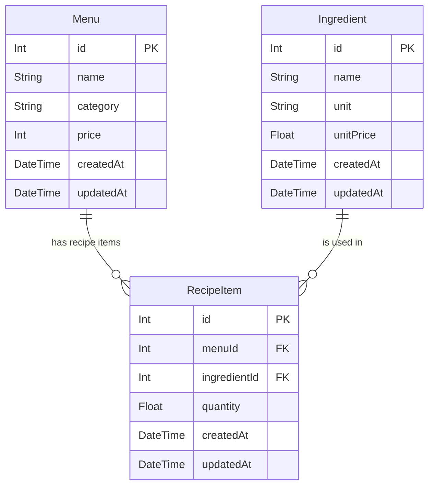

# BOSS PROFIT DB Schema



## 설계 핵심

`Menu`와 `Ingredient`는 다대다에 가까운 관계입니다.

하지만 원가 계산에는 단순 연결만이 아니라 "이 메뉴에 이 재료가 얼마나 들어가는지"가 필요합니다. 그래서 `RecipeItem`을 중간 테이블로 두고 `quantity`를 저장합니다.

```text
Menu 1 --- N RecipeItem N --- 1 Ingredient
```

원가 계산:

```text
재료별 원가 = RecipeItem.quantity * Ingredient.unitPrice
메뉴 총 원가 = 재료별 원가 합계
마진 = Menu.price - 메뉴 총 원가
```
